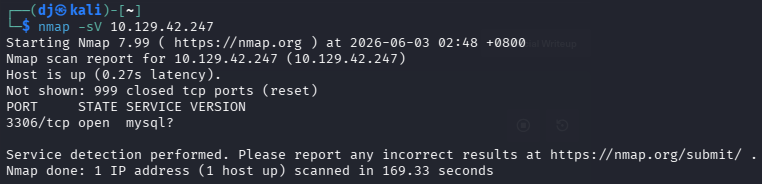
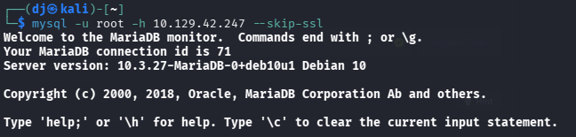
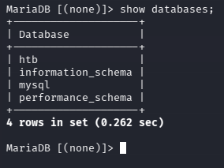
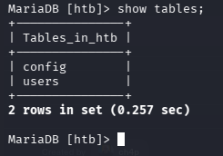
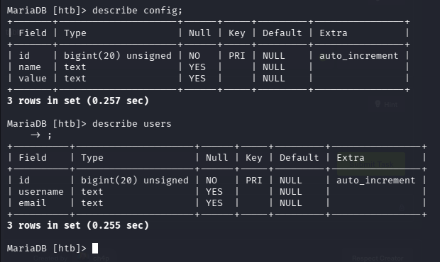
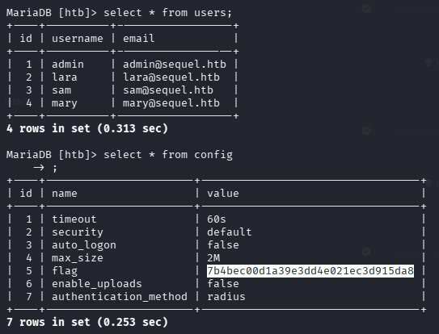

# HTB — Sequel (Starting Point Tier 1)
**Date:** June 3, 2026
**Difficulty:** Very Easy
**OS:** Linux

## Tasks
* **Task 1:** During our scan, which port do we find serving MySQL? **3306**
* **Task 2:** What community-developed MySQL version is the target running? **MariaDB**
* **Task 3:** When using the MySQL command line client, what switch do we need to use in order to specify a login username? **-u**
* **Task 4:** Which username allows us to log into this MariaDB instance without providing a password? **root**
* **Task 5:** In SQL, what symbol can we use to specify within the query that we want to display everything inside a table? **\***
* **Task 6:** In SQL, what symbol do we need to end each query with? **;**
* **Task 7:** There are three databases in this MySQL instance that are common across all MySQL instances. What is the name of the fourth that's unique to this host? **htb**
* **Task 8:** What is the command in MySQL to select a database to interact with? **use**
* **Task 9:** What is the command in MySQL to show the different columns for a given table? **describe**
* **Task 10:** Which table has a column named "flag"? **config**

## Objective
Get the root flag from a misconfigured MariaDB database.

## Tools Used
- nmap
- mysql

## Methodology
1. Ran `nmap` to scan for open ports → found port 3306 running MariaDB.
2. Connected to the database using the `mysql` client as the `root` user with a blank password.
3. Enumerated the available databases and selected the `htb` database.
4. Explored the tables and columns within the `htb` database to locate the `config` table.
5. Retrieved the flag by querying all data from the `config` table.

## Step-by-Step

**Step 1: Enumeration**
An Nmap scan reveals that port 3306 is open and running a MariaDB service.

**Step 2: Connecting to the Database**
We connect to the target database using the `mysql` command-line client, specifying the `root` user and the target's IP address. No password is required.

**Step 3: Enumerating Databases**
Once connected, we use the `SHOW DATABASES;` command to list the databases and find a unique database named `htb`. We select it using the `use htb;` command.

**Step 4: Finding the Tables**
We list the tables in the `htb` database using `SHOW TABLES;` and identify the `config` table.

**Step 5: Examining the Columns**
Using the `describe config;` command, we inspect the structure of the `config` table and find it contains a column named `flag`.

**Step 6: Retrieving the Flag**
We execute `SELECT * FROM config;` to dump the contents of the table, revealing the flag.

## Key Learning
Exposing a database service directly to the internet without implementing proper authentication (such as leaving the `root` password blank) is a critical security flaw. It grants attackers unrestricted access to view, modify, or exfiltrate sensitive data.

## Flag
[7b4bec00d1a39e3dd4e021ec3d915da8]