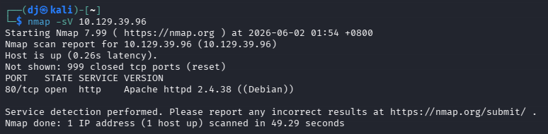
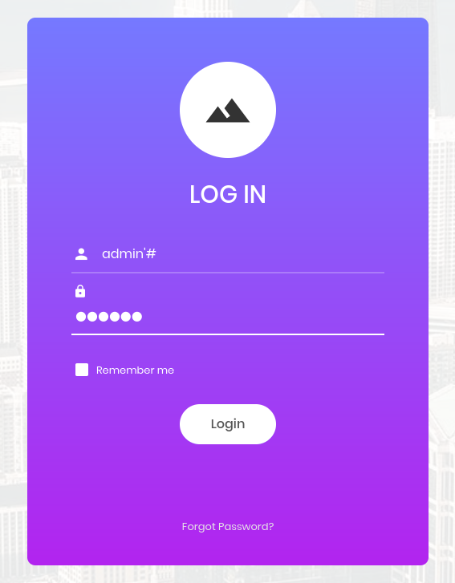
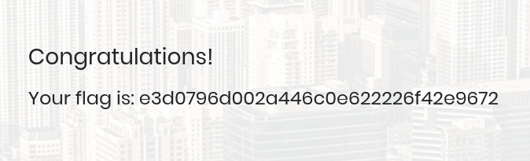

# HTB — Appointment (Starting Point Tier 1)
**Date:** June 2, 2026
**Difficulty:** Very Easy
**OS:** Linux

## Tasks
* **Task 1:** What does the acronym SQL stand for? **Structured Query Language**
* **Task 2:** What is one of the most common type of SQL vulnerabilities? **SQL injection**
* **Task 4:** What is the 2021 OWASP Top 10 classification for this vulnerability? **A03:2021-Injection**
* **Task 5:** What does Nmap report as the service and version that are running on port 80 of the target? **Apache httpd 2.4.38 ((Debian))**
* **Task 6:** What is the standard port used for the HTTPS protocol? **443**
* **Task 7:** What is a folder called in web-application terminology? **directory**
* **Task 8:** What is the HTTP response code that is returned for `Not Found` errors? **404**
* **Task 9:** Gobuster is one tool used to brute force directories on a webserver. What switch do we use with Gobuster to specify we're looking to discover directories, and not subdomains? **dir**
* **Task 10:** What single character can be used to comment out the rest of a line in MySQL? **#**
* **Task 11:** If user input is not handled carefully, it could be interpreted as a comment. Use a comment to login as admin without knowing the password. What is the first word on the webpage returned? **Congratulations**

## Objective
Exploit a SQL injection vulnerability on a login page to bypass authentication and retrieve the flag.

## Tools Used
- nmap
- Web Browser

## Methodology
1. Ran `nmap -sV` to scan for open ports → found port 80 (HTTP) running Apache httpd 2.4.38.
2. Accessed the web application via a browser and encountered a login page.
3. Attempted a basic SQL injection payload (`admin'#`) in the username field to manipulate the backend query.
4. Successfully bypassed the password authentication and accessed the system to retrieve the flag.

## Step-by-Step

**Step 1: Enumeration**
Running an Nmap service scan reveals that port 80 is open and running an Apache web server.

**Step 2: SQL Injection (Authentication Bypass)**
Navigating to the target IP in a browser reveals a login portal. By entering `admin'#` as the username and providing any random password, we can comment out the password check in the backend SQL query.

**Step 3: Flag Capture**
The payload successfully bypasses the login, granting us access to the dashboard where the flag is displayed.

## Key Learning
Failing to sanitize user input in web applications leads to SQL Injection (SQLi) vulnerabilities. By injecting SQL meta-characters like `'` and `#`, an attacker can alter the query logic, completely bypassing authentication mechanisms.

## Flag
[e3d0796d002a446c0e622226f42e9672]
