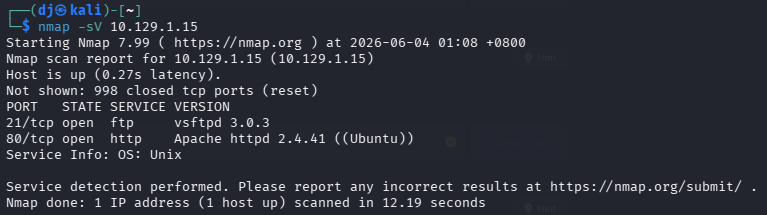
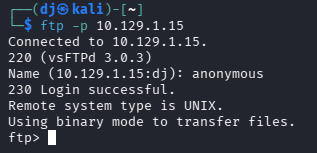
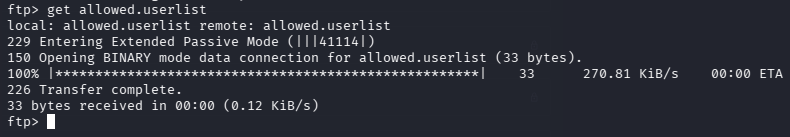
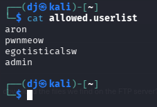
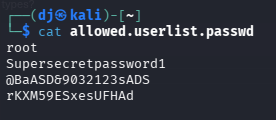
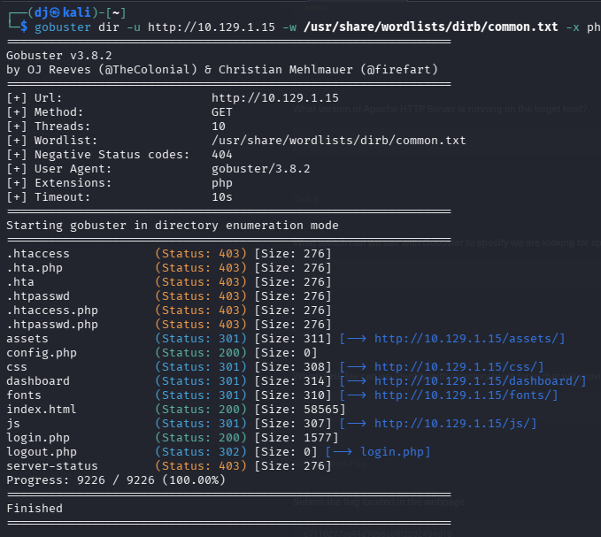
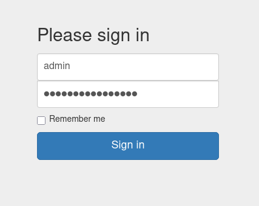
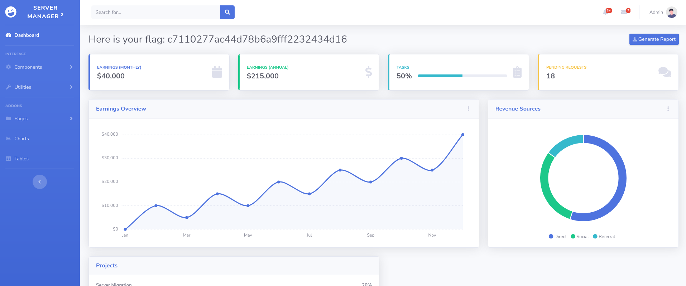

# HTB — Crocodile (Starting Point Tier 1)
**Date:** June 4, 2026
**Difficulty:** Very Easy
**OS:** Linux

## Tasks
* **Task 1:** What nmap scanning switch employs the use of default scripts during a scan? **-sC**
* **Task 2:** What service version is found to be running on port 21? **vsftpd 3.0.3**
* **Task 3:** What FTP code is returned to us for the "Anonymous FTP login allowed" message? **230**
* **Task 4:** After connecting to the FTP server using the ftp client, what username do we provide when prompted to log in anonymously? **anonymous**
* **Task 5:** After connecting to the FTP server what command can we use to download the files we find? **get**
* **Task 6:** What is one of the higher-privilege sounding usernames in the list we downloaded? **admin**
* **Task 7:** What version of Apache HTTP Server is running on the target host? **Apache httpd 2.4.41**
* **Task 8:** What switch can we use with Gobuster to specify we are looking for specific filetypes? **-x**
* **Task 9:** Which PHP file can we identify with directory brute force that will provide the opportunity to authenticate to the web service? **login.php**

## Objective
Exploit misconfigured FTP access to gather sensitive credentials, then use them to authenticate to a hidden web login portal and retrieve the flag.

## Tools Used
- nmap
- ftp
- gobuster
- Web Browser

## Methodology
1. Ran `nmap -sV` to scan for open ports → found port 21 (FTP) running vsftpd 3.0.3 and port 80 (HTTP) running Apache 2.4.41.
2. Connected to the FTP server using anonymous authentication and downloaded user lists and passwords.
3. Used `gobuster` to brute-force web directories and discovered a hidden `login.php` page.
4. Authenticated on the web portal using the admin credentials gathered from the FTP server to access the dashboard and retrieve the flag.

## Step-by-Step

**Step 1: Enumeration**
Running an Nmap service scan reveals that port 21 (FTP) and port 80 (HTTP) are open.

**Step 2: FTP Anonymous Login**
We connect to the FTP server using the `ftp` command-line utility. The server allows anonymous logins, so we authenticate using the username `anonymous` with a blank password.

**Step 3: Downloading Sensitive Files**
Once logged in, we use the `get` command to download `allowed.userlist` and `allowed.userlist.passwd` to our local machine.

**Step 4: Credential Harvesting**
We inspect the contents of the downloaded files using the `cat` command. This reveals several usernames, including `admin`, and their corresponding passwords.

**Step 5: Web Directory Brute-Forcing**
With port 80 open, we run `gobuster` with the `-x php` flag to discover hidden PHP files. This reveals a `login.php` endpoint.

**Step 6: Web Authentication**
We navigate to `http://10.129.1.15/login.php` in a web browser and log in using the `admin` credentials we found earlier.

**Step 7: Flag Capture**
The credentials successfully grant us access to the Server Manager dashboard where the flag is displayed.

## Key Learning
Exposing sensitive files like userlists and passwords on an anonymously accessible FTP server is a critical misconfiguration. Combining this with easily discoverable login portals allows attackers to seamlessly harvest credentials and gain unauthorized access to administrative panels.

## Flag
[c7110277ac44d78b6a9fff2232434d16]