# HTB — Oopsie (Starting Point Tier 2)
**Date:** June 14, 2026
**Difficulty:** Very Easy
**OS:** Linux

## Tasks
* **Task 1:** With what kind of tool can intercept web traffic? **proxy**
* **Task 2:** What is the path to the directory on the webserver that returns a login page? **/cdn-cgi/login**
* **Task 3:** What can be modified in Firefox to get access to the upload page? **cookie**
* **Task 4:** What is the access ID of the admin user? **34322**
* **Task 5:** On uploading a file, what directory does that file appear in on the server? **/uploads**
* **Task 6:** What is the file that contains the password that is shared with the robert user? **db.php**
* **Task 7:** What executible is run with the option "-group bugtracker" to identify all files owned by the bugtracker group? **find**
* **Task 8:** Regardless of which user starts running the bugtracker executable, what's user privileges will use to run? **root**
* **Task 9:** What SUID stands for? **Set owner User ID**
* **Task 10:** What is the name of the executable being called in an insecure manner? **cat**

## Objective
Identify a hidden login page by intercepting web traffic, log in as a guest, and exploit an Insecure Direct Object Reference (IDOR) via cookie manipulation to gain administrative access. Leverage this access to upload a PHP reverse shell. Once a foothold is established, extract database credentials to move laterally to a user account, and exploit an SUID binary that insecurely calls system binaries to escalate privileges to root.

## Tools Used
- nmap
- Burp Suite (Proxy)
- Browser Developer Tools
- gobuster
- netcat (nc)
- php-reverse-shell

## Methodology
1. Ran `nmap` to discover open ports → found port 22 (SSH) and 80 (HTTP).
2. Explored the web application and configured Burp Suite to proxy web traffic.
3. Analyzed the HTTP history in Burp Suite and discovered a hidden `/cdn-cgi/login` directory.
4. Logged in using the "Guest" access feature.
5. Inspected the "Accounts" page and manipulated the `id` parameter in the URL to find the admin's Access ID.
6. Manipulated the browser cookies (`user` and `role`) to hijack the admin session (IDOR).
7. Uploaded a PHP reverse shell via the newly accessible Uploads tab.
8. Used `gobuster` to find the `/uploads` directory, set up a netcat listener, and navigated to the uploaded shell to gain initial access.
9. Caught the reverse shell with netcat and upgraded it to a fully interactive TTY.
10. Navigated the web directories and found `db.php` containing credentials to switch to the user `robert` and retrieve the user flag.
11. Identified that `robert` belongs to the `bugtracker` group and located a vulnerable SUID binary owned by root.
12. Manipulated the system `$PATH` to exploit the `bugtracker` binary's insecure call to `cat`, forcing it to spawn a root shell to retrieve the root flag.

## Step-by-Step

**Step 1: Enumeration**
An Nmap scan reveals that ports 22 (SSH) and 80 (HTTP) are open. The web server is running Apache on Ubuntu.

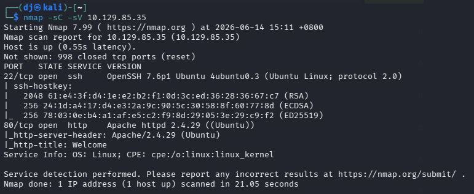

**Step 2: Web Reconnaissance**
Browsing to the web page on port 80, we are greeted by the MegaCorp Automotive home page.

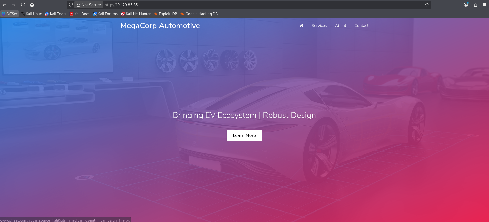

Checking the "Services" tab, we see a message indicating that we must log in to access the service, but there is no obvious login link or portal visible.

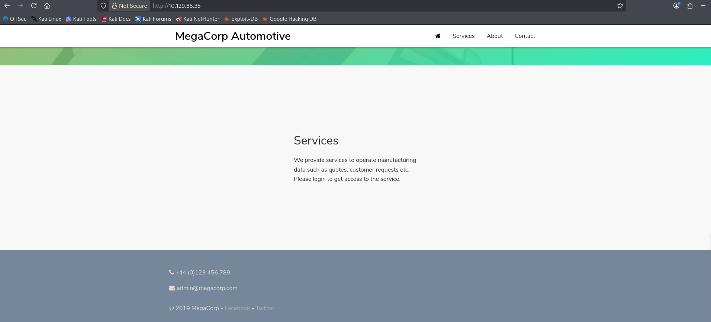

**Step 3: Proxy Configuration**
To investigate how the website communicates, we set up a proxy. We access Firefox settings to configure our network traffic to route through Burp Suite.

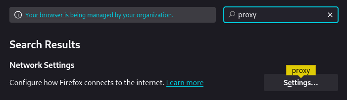
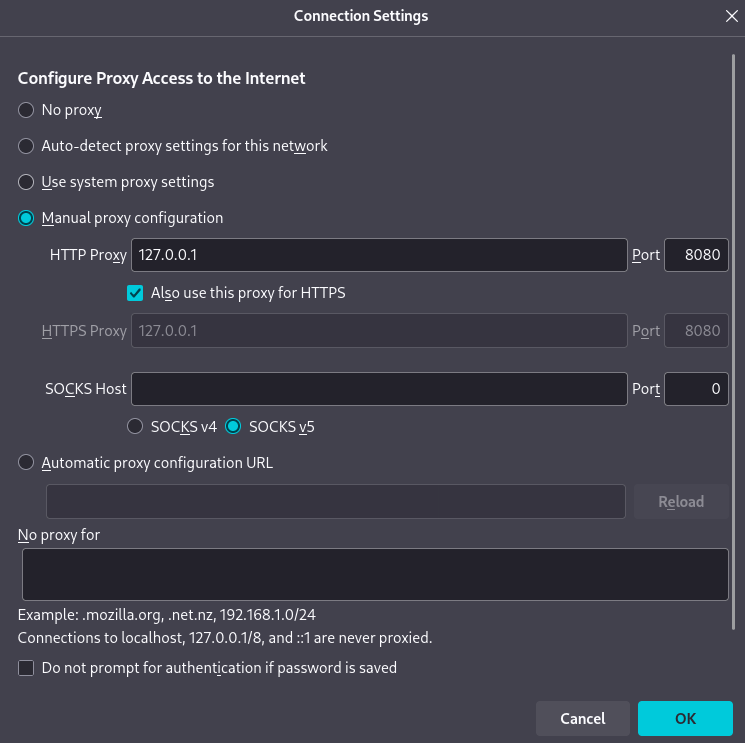

**Step 4: Intercepting Traffic & Discovering Hidden Paths**
With Burp Suite intercepting traffic (or just logging it in the HTTP history), we browse the site.

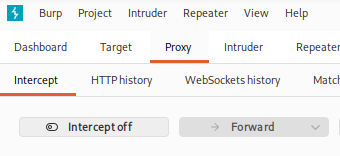

Looking at the HTTP history, we notice a request to a script located at `/cdn-cgi/login/script.js`. This reveals the path to the hidden login directory.

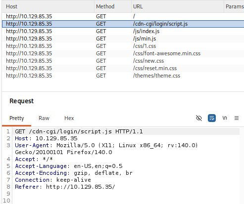

**Step 5: Login as Guest**
We navigate directly to `http://10.129.85.35/cdn-cgi/login/` in our browser and find the login portal. There is a convenient "Login as Guest" option, which we click.

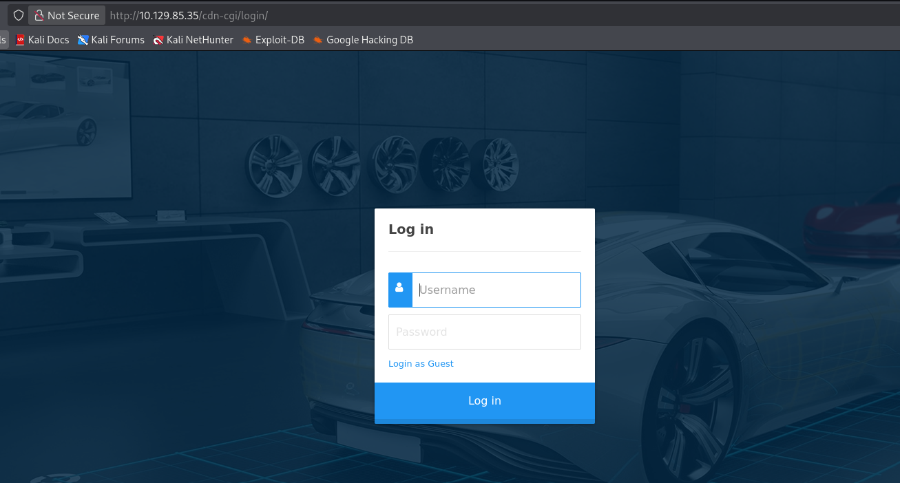

This grants us access to a "Repair Management System" dashboard. We notice several tabs, including Account, Branding, Clients, and Uploads. However, clicking on the "Uploads" tab tells us we do not have sufficient privileges. Inspecting our cookies, we see `role` is set to `guest` and `user` is set to `2233`.

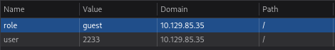

**Step 6: Discovering the Admin ID**
Checking the "Account" tab, we notice the URL parameter `id=2` displays the Guest account (ID 2233).

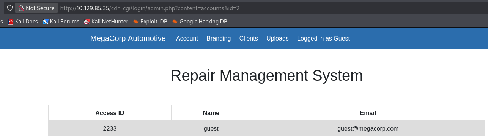

By changing this parameter to `id=1` (an Insecure Direct Object Reference or IDOR vulnerability), we can view the Admin account details. This reveals the Admin's Access ID is `34322`.

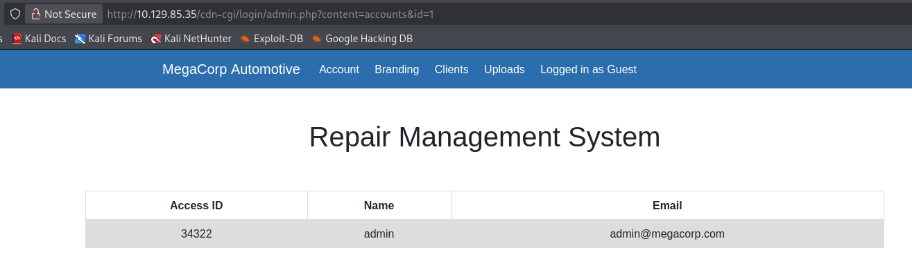

**Step 7: Cookie Manipulation**
We return to our cookie editor in the browser developer tools. Knowing the admin's ID, we change the `role` cookie to `admin` and the `user` cookie to `34322`. Refreshing the page applies our new privileges.

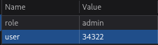

**Step 8: Uploading the Reverse Shell**
With admin privileges, the "Uploads" tab is now fully functional.

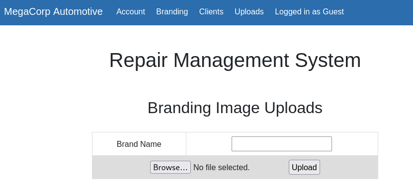

We prepare a PHP reverse shell by copying the default Kali Linux PHP shell to our working directory.

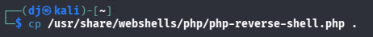

We edit it with `nano` to include our VPN IP and chosen listening port (1337).

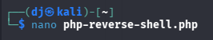

We then browse to our modified `php-reverse-shell.php` and upload it through the Branding Image Uploads form. The system confirms the successful upload.

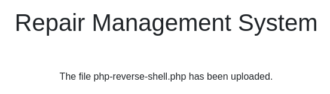

**Step 9: Finding the Upload Directory & Triggering the Shell**
To find where our shell was stored, we run a `gobuster` directory scan against the target. It quickly discovers an `/uploads` directory.

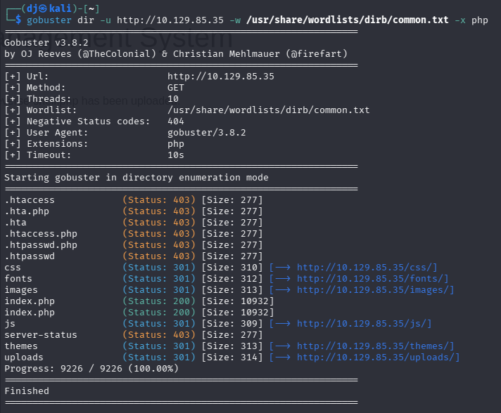

We set up a netcat listener on port 1337 (`nc -nvlp 1337`) to catch the connection.

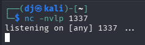

Finally, we navigate to the uploaded script in our browser (`http://10.129.85.35/uploads/php-reverse-shell.php`) to execute the code and send the reverse connection back to our machine.

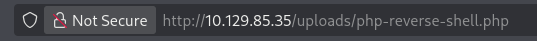

**Step 10: Catching the Shell & Upgrading**
Our netcat listener catches the connection, giving us a shell as `www-data`. We upgrade the shell to a fully interactive TTY using Python: `python3 -c 'import pty;pty.spawn("/bin/bash")'`.

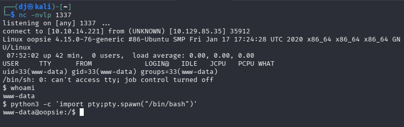

**Step 11: Lateral Movement & User Flag**
We navigate to the directory where the web application login files are stored (`/var/www/html/cdn-cgi/login`) to hunt for credentials. Running `cat * | grep -i passw*` reveals the admin password, but we want system user credentials.

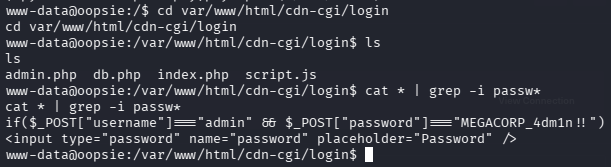

Reading the `db.php` file directly exposes database connection credentials for the user `robert`: `M3g4C0rpUs3r!`.

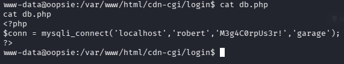

We use `su robert` and supply the discovered password to switch to the `robert` user. At this point, we can navigate to Robert's home directory and retrieve the user flag.

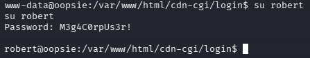

**Step 12: Finding the SUID Binary**
We run `id` to see Robert's group memberships and discover he belongs to a custom group called `bugtracker` (id 1001).

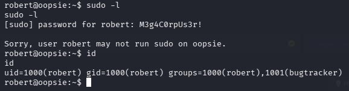

We can run `find / -group bugtracker 2>/dev/null` to locate files owned by this group. We find a binary at `/usr/bin/bugtracker`. Checking its permissions with `ls -la`, we see it has the SUID bit set (`-rwsr-xr--`) and is owned by `root`.

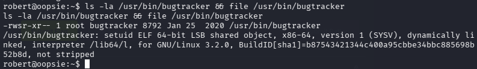

**Step 13: PATH Exploitation & Root Flag**
Running the `/usr/bin/bugtracker` binary prompts us for a Bug ID. Providing a random number like `10` throws an error: `cat: /root/reports/10: No such file or directory`. This error is highly revealing: the binary is running the system `cat` command, but without an absolute path (e.g., `/bin/cat`).

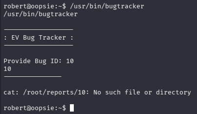

Because it uses a relative path, we can exploit the system `$PATH` environment variable. We navigate to `/tmp` and create our own malicious `cat` executable that simply spawns a shell: `echo "/bin/sh" > cat`. We then make it executable with `chmod +x cat`.

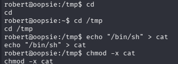

Next, we prepend the `/tmp` directory to our PATH variable: `export PATH=/tmp:$PATH`. This ensures the system will look in `/tmp` first when trying to execute a command.

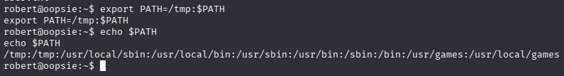

We run `/usr/bin/bugtracker` one more time and provide a Bug ID. The program attempts to run `cat`, but instead executes our malicious `/tmp/cat` script. Because the bugtracker binary has the SUID bit set, our script executes as root, granting us a root shell. We verify this with `whoami` and proceed to read the root flag.

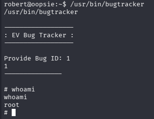
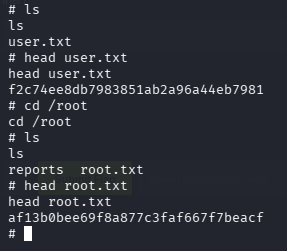

## Key Learning
Access controls built heavily on cookies can be trivially bypassed if the logic is flawed (IDOR). Modifying the `role` and `id` parameters directly in the browser granted full administrative functionality. For privilege escalation, developers must be extremely careful when writing SUID binaries. Calling system commands (like `cat`) without their absolute paths (like `/bin/cat`) leaves the program vulnerable to PATH injection, allowing a standard user to redirect the executable flow to malicious code running with root privileges.

## Flags
**User Flag:** `f2c74ee8db7983851ab2a96a44eb7981`
**Root Flag:** `af13b0bee69f8a877c3faf667f7beacf`